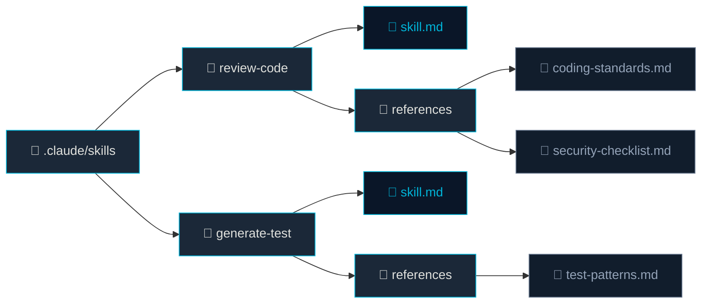

# 스킬 파일 해부

## 학습 목표

이 챕터를 완료하면 다음을 이해할 수 있습니다:

- `.claude/skills/*/skill.md` 파일의 구조와 각 필드의 역할
- 트리거 조건과 참조 디렉토리 활용법
- 스킬과 에이전트의 차이점과 협력 방식

## 스킬이란?

스킬은 에이전트가 특정 상황에서 활성화하는 **재사용 가능한 작업 지침서**입니다. 에이전트가 "누구인가"를 정의한다면, 스킬은 "무엇을 어떻게 하는가"를 정의합니다.

> [!TIP] 실무 비유
> 에이전트가 **직원**이라면, 스킬은 **업무 매뉴얼**입니다. 한 직원이 여러 매뉴얼을 참조할 수 있고, 같은 매뉴얼을 여러 직원이 공유할 수 있습니다.

## 디렉토리 구조



## skill.md 프론트매터 필드

```yaml
---
name: "코드 리뷰"
description: "변경된 코드의 품질, 보안, 성능을 검사합니다"
trigger: "/review"
allowed-tools:
  - Read
  - Grep
  - Glob
  - Bash
---
```

| 필드 | 필수 | 설명 | 예시 |
|------|------|------|------|
| `name` | O | 스킬의 표시 이름 | `"코드 리뷰"` |
| `description` | O | 목적 요약 (자동 매칭에 활용) | `"변경된 코드 품질 검사"` |
| `trigger` | X | 슬래시 커맨드 호출명 | `"/review"` |
| `allowed-tools` | X | 스킬 실행 시 허용할 도구 | `[Read, Grep]` |

> [!WARNING] trigger 네이밍 규칙
> 트리거는 `/`로 시작하며 영문 소문자와 하이픈만 사용합니다. `/code-review`는 가능하지만 `/Code Review`나 `/코드리뷰`는 불가합니다.

## 마크다운 본문: 작업 지침

프론트매터 아래 본문이 스킬의 **실행 지침**입니다. 에이전트가 이 스킬을 호출하면 본문이 컨텍스트에 주입됩니다.

```markdown
---
name: "코드 리뷰"
trigger: "/review"
allowed-tools: [Read, Grep, Glob]
---

## 리뷰 수행 절차
1. `git diff`로 변경된 파일 목록을 확인한다
2. 각 파일을 읽고 체크리스트를 기준으로 검사한다
3. 결과를 심각도별로 분류하여 보고한다

## 체크리스트
- 하드코딩된 비밀번호/API 키가 없는가
- SQL 쿼리에 파라미터 바인딩을 사용하는가
- N+1 쿼리 패턴이 없는가
- 함수 길이가 30줄을 초과하지 않는가
```

## references 디렉토리 활용

`references/`의 파일들은 스킬 실행 시 자동으로 컨텍스트에 포함됩니다. 사내 코딩 표준, 체크리스트 등을 이곳에 배치하세요.

> [!INFO] references의 장점
> 시스템 프롬프트에 모든 규칙을 넣으면 토큰을 낭비합니다. references에 분리하면 **해당 스킬이 호출될 때만** 로드되므로 효율적입니다.

## 스킬 vs 에이전트 비교

| 구분 | 에이전트 | 스킬 |
|------|---------|------|
| 정의 위치 | `.claude/agents/*.md` | `.claude/skills/*/skill.md` |
| 역할 | 페르소나와 전체 행동 규칙 | 특정 작업의 실행 절차 |
| 호출 방식 | 직접 지정하여 실행 | 트리거 또는 자동 매칭 |
| 도구 설정 | `tools` / `disallowedTools` | `allowed-tools` |
| 참조 자료 | 본문에 직접 기술 | `references/` 디렉토리로 분리 |
| 재사용성 | 독립적 실행 단위 | 여러 에이전트가 공유 가능 |

## 트리거의 두 가지 활성화 방식

```bash
# 1. 명시적 호출: 슬래시 커맨드
claude "/review src/services/payment.ts"

# 2. 자동 매칭: description 기반 의미 매칭
claude "이 코드 좀 리뷰해줘"  # → "코드 리뷰" 스킬이 자동 활성화
```

## 요약

- 스킬은 `.claude/skills/*/skill.md`에 정의하는 재사용 가능한 작업 지침
- 프론트매터에 이름, 설명, 트리거, 허용 도구를 설정
- `references/`로 상세 자료를 분리하여 토큰 효율성 확보
- 슬래시 커맨드 또는 description 기반 자동 매칭으로 트리거
