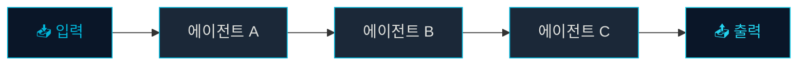
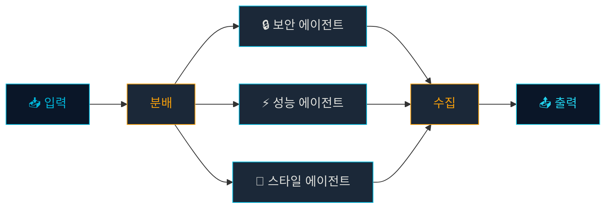
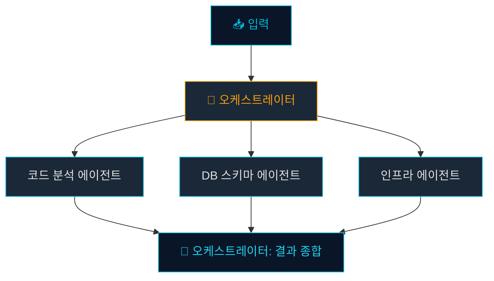
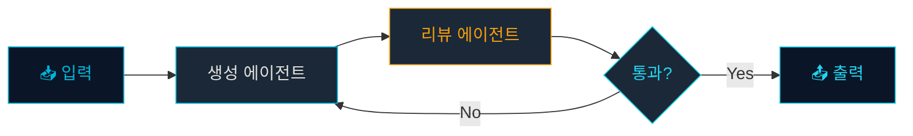

# 아키텍처 패턴: 파이프라인에서 계층 위임까지

## 학습 목표

이 챕터를 완료하면 다음을 이해할 수 있습니다:

- 하네스 시스템의 4가지 주요 아키텍처 패턴
- 각 패턴이 적합한 상황과 트레이드오프
- 삼성 실무 시나리오에 맞는 패턴 선택 기준

## 패턴 1: 파이프라인 (Pipeline)

작업이 **순차적으로** 에이전트를 거치며 처리되는 가장 단순한 패턴입니다.



**적합한 상황**: 코드 생성 → 리뷰 → 테스트처럼 단계가 명확히 분리되는 경우

| 장점 | 단점 |
|------|------|
| 구현이 단순하고 디버깅 용이 | 전체 소요 시간이 각 단계의 합 |
| 각 단계의 입출력이 명확 | 중간 단계 실패 시 전체 중단 |

> [!TIP] 삼성 적용 예시
> **배포 전 코드 검증**: PR 코드 → 정적 분석 에이전트 → 보안 검사 에이전트 → 테스트 커버리지 에이전트 → 최종 리포트 생성

## 패턴 2: 팬아웃/팬인 (Fan-out / Fan-in)

하나의 입력을 **여러 에이전트가 동시에** 처리하고 결과를 합산합니다.



**적합한 상황**: 동일 코드를 보안/성능/가독성 관점에서 동시에 분석하는 경우

| 장점 | 단점 |
|------|------|
| 병렬 처리로 속도 향상 | 결과 병합 로직이 필요 |
| 각 에이전트가 독립적 | 에이전트 간 충돌하는 의견 처리 필요 |

> [!WARNING] 결과 충돌 처리
> 보안 에이전트는 "함수를 제거하라"고, 성능 에이전트는 "유지하되 캐싱하라"고 할 수 있습니다. 팬인 단계에서 **우선순위 규칙**(보안 > 성능 > 스타일)을 반드시 정의하세요.

## 패턴 3: 계층 위임 (Hierarchical Delegation)

**오케스트레이터가 작업을 분석하고 적절한 하위 에이전트에게 위임**합니다.



**적합한 상황**: 요청 유형이 다양하고, 어떤 에이전트가 필요한지 사전에 알 수 없는 경우

```typescript
// 오케스트레이터의 판단 로직 (개념)
function selectAgents(request: string): string[] {
  if (request.includes('로그')) return ['log-analyzer'];
  if (request.includes('API')) return ['api-reviewer', 'doc-generator'];
  if (request.includes('마이그레이션')) return ['db-agent', 'code-agent'];
  return ['general-agent'];
}
```

| 장점 | 단점 |
|------|------|
| 유연한 작업 분배 | 오케스트레이터 설계가 복잡 |
| 새 에이전트 추가 용이 | 잘못된 위임 시 품질 저하 |

## 패턴 4: 리뷰 루프 (Review Loop)

생성과 리뷰를 **품질 기준을 통과할 때까지 반복**합니다.



**적합한 상황**: 코드 품질, 문서 정확성 등 일정 기준을 반드시 충족해야 하는 경우

> [!TIP] 최대 반복 횟수 설정
> 리뷰 루프에는 반드시 `MAX_RETRIES`를 설정하세요. 무한 루프를 방지하고, 3회 이상 실패 시 사람에게 에스컬레이션하는 것이 안전합니다.

## 패턴 선택 가이드

| 상황 | 권장 패턴 | 이유 |
|------|----------|------|
| 단순 코드 생성 후 검증 | 파이프라인 | 순서 명확, 구현 단순 |
| 다관점 코드 리뷰 | 팬아웃/팬인 | 병렬 분석으로 속도 확보 |
| 다양한 유형의 요청 | 계층 위임 | 동적 에이전트 선택 |
| 높은 품질 기준 | 리뷰 루프 | 반복 개선으로 품질 보장 |
| 복잡한 실무 워크플로우 | 패턴 조합 | 파이프라인 + 팬아웃 혼합 |

> [!INFO] 다음 챕터 미리보기
> 다음 챕터에서는 직접 커스텀 스킬을 만들어보는 실습을 진행합니다. 코드 리뷰 스킬을 처음부터 작성하며 위 패턴을 적용해봅니다.

## 요약

- **파이프라인**: 순차 처리, 단순하고 명확한 흐름에 적합
- **팬아웃/팬인**: 병렬 처리, 다관점 분석에 적합
- **계층 위임**: 오케스트레이터가 동적으로 에이전트를 선택
- **리뷰 루프**: 생성-검증 반복으로 품질 기준 충족 보장
- 실무에서는 패턴을 조합하여 사용하는 것이 일반적
