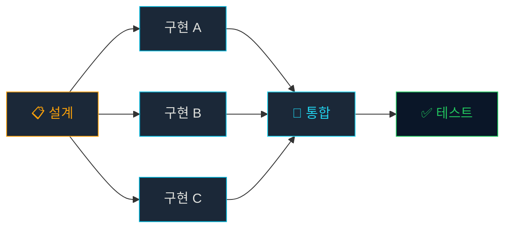
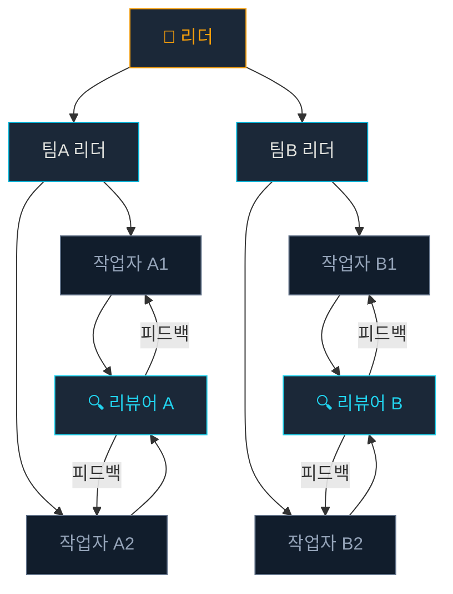
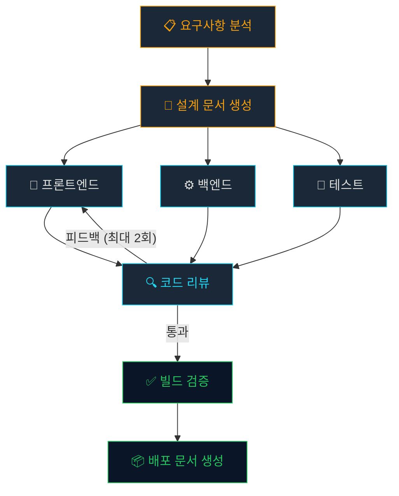

# 복합 패턴: 실전 하네스 조합

## 학습 목표

- 여러 하네스 패턴을 조합하여 복잡한 워크플로우를 구성할 수 있다
- 패턴 간 트레이드오프를 이해하고 적절히 선택할 수 있다
- 삼성 실무 시나리오에 맞는 복합 패턴을 설계할 수 있다

## 기본 패턴 복습

| 패턴 | 구조 | 장점 | 단점 |
|------|------|------|------|
| 파이프라인 | A → B → C | 단순, 예측 가능 | 병목 발생 |
| 팬아웃/팬인 | A → (B∥C∥D) → E | 병렬 처리 | 동기화 복잡 |
| 계층 위임 | A → B → (C∥D) | 유연함 | 오케스트레이션 비용 |
| 리뷰 루프 | A → B → R → (수정?) → B | 품질 보장 | 시간 증가 |

## 복합 패턴 1: 파이프라인 + 팬아웃



설계 결과를 기반으로 여러 구현 에이전트가 동시에 작업하고, 통합 에이전트가 합칩니다.

```markdown
# 오케스트레이터 워크플로우
1. designer에게 설계 요청 (순차)
2. frontend-dev, backend-dev, test-writer에게 병렬 요청
3. integrator에게 통합 요청 (순차)
4. npm run build && npm test 실행
```

> [!TIP] 인터페이스 계약
> 병렬 에이전트들이 서로의 코드를 모르므로, 설계 단계에서 **타입 정의와 API 인터페이스**를 확정하는 것이 핵심입니다.

## 복합 패턴 2: 계층 위임 + 리뷰 루프



대규모 프로젝트에서 팀별로 독립적인 리뷰 사이클을 운영합니다.

> [!WARNING] 리뷰 사이클 제한
> 리뷰 루프는 최대 2~3 사이클로 제한하세요. 무한 루프에 빠지면 AI 에이전트가 같은 문제를 반복 수정하는 비효율이 발생합니다.

## 복합 패턴 3: 조건부 분기

```typescript
// 오케스트레이터 로직
const analysisResult = await agent("analyzer").run(task);

if (analysisResult.complexity === "high") {
  // 복잡한 경우: 전문 에이전트 팀 투입
  await parallel([
    agent("senior-dev").run(coreLogic),
    agent("test-writer").run(testCases),
  ]);
} else {
  // 단순한 경우: 단일 에이전트
  await agent("junior-dev").run(fullTask);
}
```

## 삼성 시나리오: 빌드 파이프라인



> [!INFO] 점진적 도입
> 처음부터 복합 패턴을 적용하지 마세요. 단순 파이프라인부터 시작하여, 병목이 발생하는 지점에 병렬화를 추가하는 점진적 접근이 안전합니다.

## 요약

- 기본 패턴을 조합하여 복잡한 워크플로우 구성 가능
- 인터페이스 계약이 병렬 에이전트 간 독립성의 핵심
- 리뷰 루프는 반드시 최대 사이클 수 제한
- 점진적 도입이 안전한 전략
