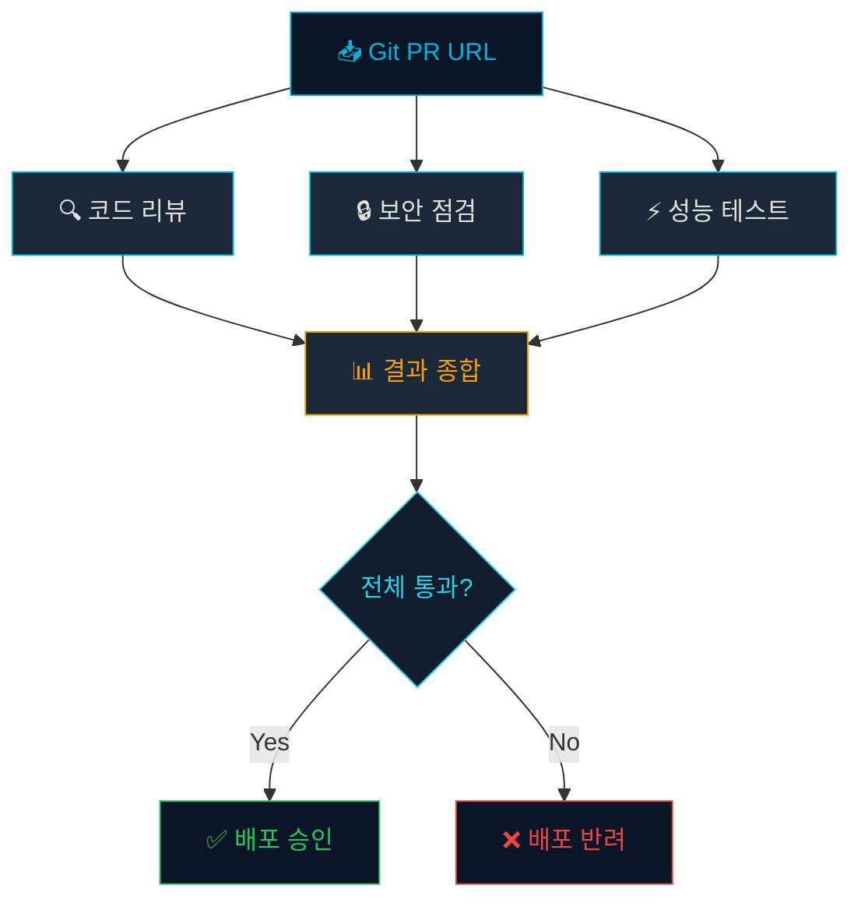
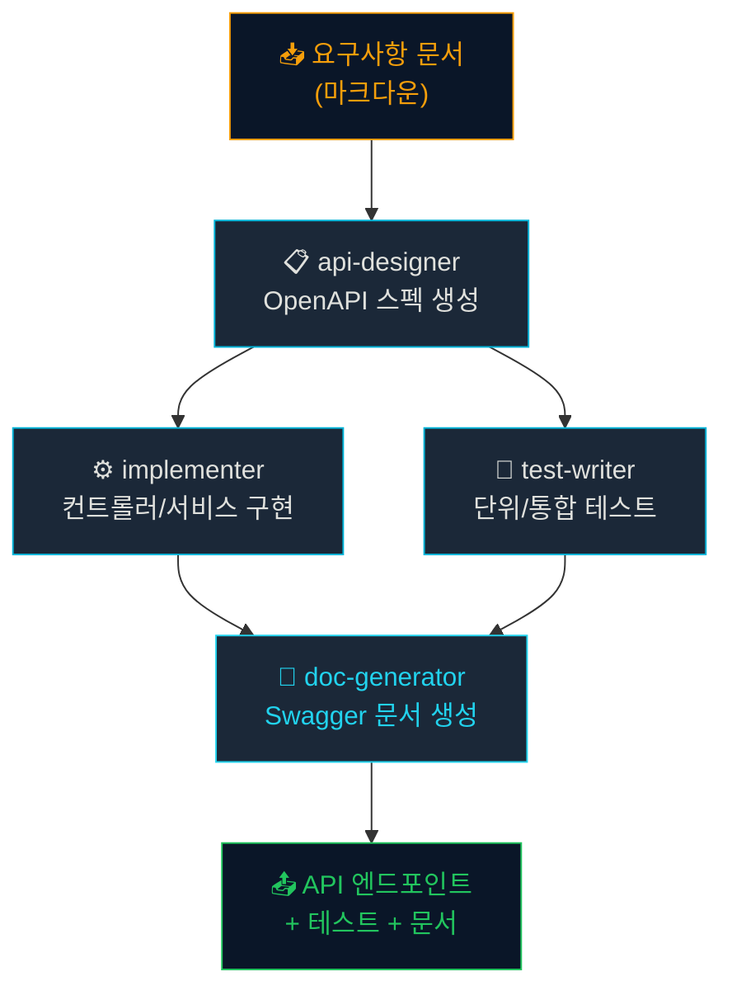
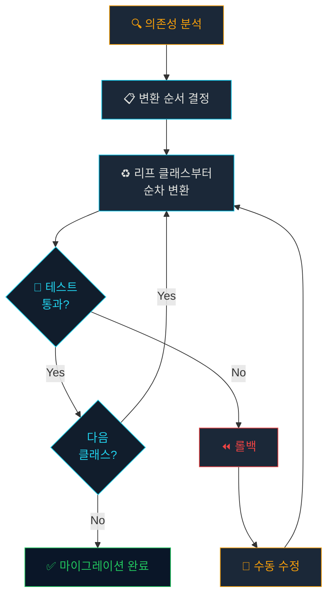

# 워크숍: 삼성 시나리오 적용 설계

## 학습 목표

- 실제 삼성 업무 시나리오에 하네스 패턴을 적용하는 설계 능력을 키운다
- 팀 토론을 통해 다양한 접근 방식의 장단점을 비교할 수 있다
- 자신의 업무에 즉시 적용 가능한 하네스를 설계할 수 있다

## 워크숍 진행 방식

1. 시나리오 읽기 (5분)
2. 개인 설계 (15분)
3. 팀 토론 (10분)
4. 발표 및 피드백 (10분)

## 시나리오 1: 배포 전 자동 점검

**상황**: 매주 금요일 배포 전에 코드 리뷰, 보안 점검, 성능 테스트를 수행합니다. 현재 3명이 각각 수동으로 진행하고 있어 4시간이 소요됩니다.

**설계 과제**: 이 과정을 하네스로 자동화하세요.



> [!TIP] 설계 힌트
> 팬아웃 패턴이 적합합니다. 3개 에이전트가 병렬로 점검하고, 통합 에이전트가 결과를 종합합니다.

## 시나리오 2: 신규 API 엔드포인트 생성

**상황**: 신규 기능 요청이 들어오면 API 설계 → 구현 → 테스트 → 문서화를 순차적으로 진행합니다.

**설계 과제**: 요구사항 문서 하나로 전체 파이프라인을 자동화하세요.



## 시나리오 3: 레거시 코드 마이그레이션

**상황**: Java 8로 작성된 유틸리티 모듈을 Kotlin으로 마이그레이션해야 합니다. 50개 클래스, 약 1만 줄입니다.

**설계 과제**: 점진적 마이그레이션 하네스를 설계하세요.



> [!WARNING] 전체 변환 금지
> 1만 줄을 한번에 AI에게 변환 요청하면 높은 확률로 실패합니다. **파일 단위로, 의존성 순서대로** 점진적으로 진행해야 합니다.

## 설계 템플릿

각 시나리오의 설계서를 다음 형식으로 작성하세요:

```markdown
## 하네스 설계서

### 에이전트 목록
| 이름 | 역할 | 입력 | 출력 |
|------|------|------|------|

### 실행 흐름
1. (순차/병렬 표시)
2. ...

### 품질 게이트
- [ ] 게이트 조건 1
- [ ] 게이트 조건 2

### 실패 대응
- 실패 시나리오 A → 대응 전략
- 실패 시나리오 B → 대응 전략
```

> [!INFO] 정답은 없다
> 같은 시나리오에도 여러 설계가 가능합니다. 중요한 것은 **왜 이 구조를 선택했는지** 설명할 수 있는 것입니다.

## 요약

- 실제 삼성 업무 시나리오에 하네스 패턴을 적용하는 실전 워크숍
- 배포 점검, API 생성, 레거시 마이그레이션 3가지 시나리오
- 설계 → 토론 → 피드백의 반복 학습
- "왜 이 구조인가"를 설명할 수 있는 것이 핵심
