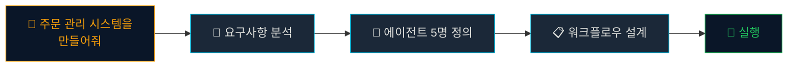
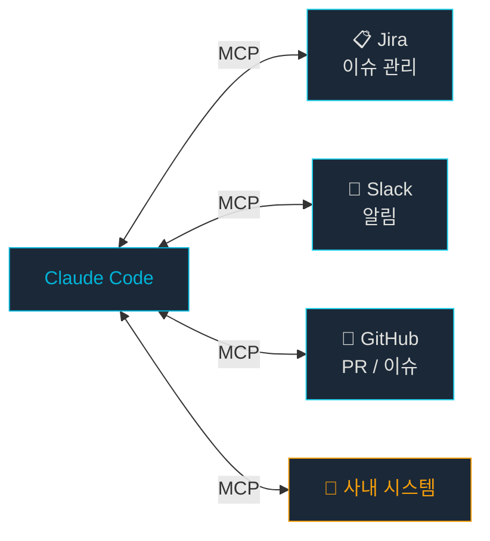

# 다음 단계: 하네스 에코시스템 로드맵

## 학습 목표

- 현재 AI 개발 도구 생태계의 발전 방향을 이해한다
- 하네스 기반 개발의 확장 가능성을 파악한다
- 삼성에서의 다음 단계 액션 플랜을 수립할 수 있다

## 우리가 배운 것

6개 모듈을 통해 다음을 학습했습니다:

| 모듈 | 핵심 역량 |
|------|----------|
| Module 1 | Claude Code + Gemini CLI 기본 사용 |
| Module 2 | 하네스 시스템 (에이전트, 스킬, 오케스트레이터) |
| Module 3 | 프로젝트 스펙, 팀 구성, 오케스트레이터 설계 |
| Module 4 | PoC: 로그 분석기 (파싱, 이상 탐지, 시각화) |
| Module 5 | PoC: 운영 대시보드 (실시간 메트릭, 차트, 알림) |
| Module 6 | 고급 패턴, 에러 처리, 폐쇄망 전략 |

## 생태계 발전 방향

### 1. 에이전트 팀 자동화 고도화

현재: 에이전트를 사람이 정의하고 오케스트레이터를 설계
미래: AI가 요구사항을 분석해 **자동으로 팀 구성과 워크플로우를 설계**

### 2. MCP (Model Context Protocol) 확장

외부 시스템과 AI를 연결하는 표준 프로토콜:

> [!INFO] MCP의 의미
> MCP는 AI 도구가 외부 시스템과 통신하는 표준입니다. 삼성 사내 시스템에 MCP 어댑터를 구현하면 AI가 직접 사내 도구와 연동할 수 있습니다.

### 3. 멀티 모델 오케스트레이션

하나의 하네스에서 여러 AI 모델을 역할별로 사용:

| 역할 | 모델 | 이유 |
|------|------|------|
| 설계 | Opus (고성능) | 복잡한 추론 필요 |
| 구현 | Sonnet (균형) | 코드 생성 효율 |
| 검증 | Haiku (빠름) | 빠른 체크 반복 |

## 삼성에서의 다음 단계

### 단기 (1-3개월)

1. **팀 내 파일럿**: 코드 리뷰 자동화부터 시작
2. **스킬 라이브러리**: 반복적인 작업을 스킬로 정의
3. **모범 사례 공유**: 성공/실패 경험을 팀 간 공유

### 중기 (3-6개월)

1. **사내 하네스 표준**: 에이전트 정의 템플릿 표준화
2. **CI/CD 연동**: 배포 파이프라인에 AI 점검 단계 추가
3. **폐쇄망 전용 AI 환경**: 온프레미스 AI 도구 검토

### 장기 (6-12개월)

1. **MCP 사내 시스템 연동**: Jira, Confluence, 사내 Git 등
2. **자동화 성숙도 측정**: 자동화율, 품질 메트릭 대시보드
3. **조직 확산**: 다른 팀/부서로 성공 모델 전파

> [!TIP] 작게 시작하기
> 첫 번째 하네스는 **일주일 안에 만들 수 있는 규모**로 시작하세요. 성공 경험이 쌓이면 자연스럽게 범위가 확장됩니다.

## 추천 리소스

- Claude Code 공식 문서: code.claude.com/docs
- Gemini CLI 공식 문서: cloud.google.com/gemini
- MCP 프로토콜: modelcontextprotocol.io
- 이 교육 플랫폼의 PoC 소스 코드

> [!WARNING] AI 도구는 빠르게 변합니다
> 이 교육 자료의 구체적인 명령어나 기능은 도구 업데이트로 변경될 수 있습니다. 핵심은 도구의 사용법이 아니라 **"AI와 협업하는 사고방식"**입니다.

## 마치며

AI 기반 개발은 선택이 아닌 필수가 되어가고 있습니다. 하네스 시스템을 통해 AI를 체계적으로 활용하는 역량은 삼성 개발자로서의 경쟁력을 높여줄 것입니다.

이 교육이 여러분의 AI 활용 여정의 출발점이 되기를 바랍니다.

## 요약

- 에이전트 팀 자동화, MCP, 멀티 모델 오케스트레이션이 발전 방향
- 단기: 파일럿 → 중기: 표준화 → 장기: 조직 확산
- 작게 시작하여 성공 경험을 쌓는 것이 핵심
- AI 도구보다 "AI와 협업하는 사고방식"이 더 중요
